# ai_core 代码结构与设计解析

## 1. 目录结构总览

```
ai_core/code/
├── include/                  # 头文件
│   ├── base/                 # 基础数据结构与公共定义
│   ├── input/                # 输入模块接口
│   ├── method/               # 算法方法接口
│   ├── output/               # 输出模块接口
│   ├── plugin/               # 插件系统接口
│   └── utils/                # 工具函数接口
├── src/                      # 源文件
│   ├── simple_example.cc     # 主程序入口
│   ├── input/                # 输入模块实现
│   ├── method/               # 算法方法实现
│   ├── output/               # 输出模块实现
│   ├── plugin/               # 插件系统实现
│   └── utils/                # 工具函数实现
├── CMakeLists.txt
├── build_all.sh
└── resolve.sh
```

---

## 2. 整体架构设计

整个系统采用 **生产者-消费者 + 插件化** 的流水线架构，核心由三个插件协同驱动：

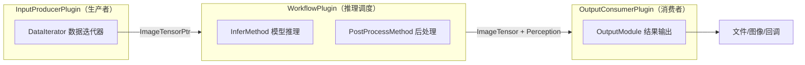

**数据流向：**
1. `InputProducerPlugin` 读取数据文件，封装为 `ImageTensor`，推入工作队列
2. `WorkflowPlugin` 从队列取帧，依次执行 `InferMethod`（DNN推理）和 `PostProcessMethod`（后处理），生成 `Perception`
3. `OutputConsumerPlugin` 消费推理结果，调用 `OutputModule` 写出（图像/文本/回调）

---

## 3. 核心数据结构

### 3.1 输入数据 — `ImageTensor`
> 定义于 [`include/input/input_data.h`](../include/input/input_data.h)

| 字段 | 类型 | 说明 |
|------|------|------|
| `tensor` | `hbDNNTensor` | 单帧张量（兼容旧接口） |
| `tensors` | `vector<hbDNNTensor>` | 多输入张量（多帧/多摄） |
| `frame_id` | `int32_t` | 帧序号 |
| `image_name` | `string` | 原始图像文件名 |
| `pre_duration` | `uint64_t` | 预处理耗时（微秒） |
| `frames_per_sample_infer` | `int32_t` | 单次推理帧数（时序模型） |
| `ori_image_path_list` | `vector<string>` | 多摄图像路径列表 |

### 3.2 感知结果 — `Perception`
> 定义于 [`include/base/perception_common.h`](../include/base/perception_common.h)

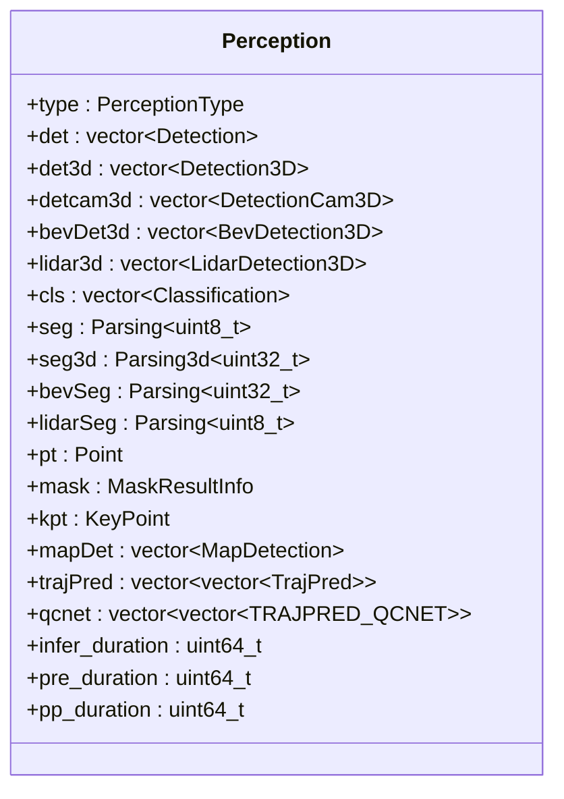

**支持的感知类型（`PerceptionType`）：**

| 枚举值 | 说明 |
|--------|------|
| `DET` | 2D目标检测 |
| `DET3D` | 3D目标检测 |
| `DETCAM3D` | 相机3D检测 |
| `LIDAR3D` | 激光雷达3D检测 |
| `BEV` | BEV多任务（检测+分割） |
| `SEG` | 语义分割 |
| `SEG3D` | 3D语义分割 |
| `CLS` | 图像分类 |
| `KEYPOINT` | 关键点检测 |
| `MASK` | 实例分割 |
| `POINT` / `DEPTH` | 光流 / 深度估计 |
| `TRAJPRED` / `TRAJPRED_qcnet` | 轨迹预测 |
| `MAP` | 在线地图检测 |
| `LIDARMULTITASK` | 激光雷达多任务（检测+分割） |

---

## 4. 插件系统

三大插件均继承自 `BasePlugin`，以单例模式运行，通过 JSON 配置初始化。

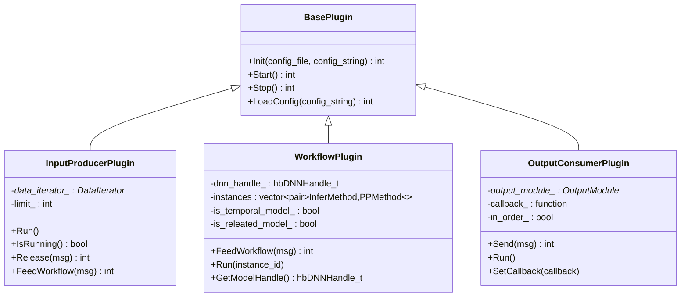

### 4.1 InputProducerPlugin
- 通过 `DataIterator` 抽象接口支持多种数据源（图像列表、bin文件、点云等）
- `Run()` 循环调用 `DataIterator::Next()` 送帧，`IsRunning()` 判断数据集是否耗尽
- `limit_` 字段控制最大处理帧数，可通过配置文件的 `"limit"` 字段设置

### 4.2 WorkflowPlugin
- 支持**多线程并发推理**（`thread_count` 配置）
- 支持**时序模型**（`is_temporal_model_`）：维护 `temporal_tensor_` 缓存历史帧输出，下一帧推理时注入
- 支持**关联模型**（`is_releated_model_`）：主模型输出张量作为副模型输入
- 支持**多帧批量推理**（`infer_fram_nums_`）

### 4.3 OutputConsumerPlugin
- 支持**有序输出**（`in_order_`）：保证帧顺序与输入一致
- 支持**外部回调**（`SetCallback`）：供 `ai_wrapper` 层注册 ROS 回调
- 统计并打印**端到端延迟**（预处理/推理/后处理 avg/max/min）

---

## 5. 输入（Input）模块

### 5.1 DataIterator 抽象接口

> 定义于 [`include/input/data_iterator.h`](../include/input/data_iterator.h)

`DataIterator` 是所有数据源的统一抽象接口，通过工厂模式按 `input_type` 字符串创建具体实现。

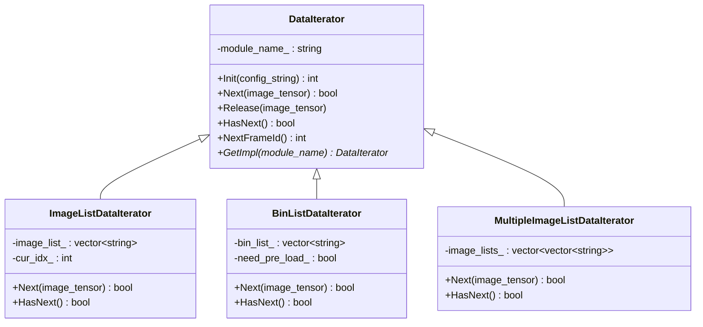

**主要 DataIterator 实现：**

| input_type 配置值 | 实现类 | 说明 |
|-------------------|--------|------|
| `image_list` | `ImageListDataIterator` | 读取图像文件列表，逐帧预处理为张量 |
| `bin_list` | `BinListDataIterator` | 读取预处理好的 `.bin` 二进制张量文件 |
| `multiple_image_list` | `MultipleImageListDataIterator` | 多路图像列表（多摄相机模型，如BEV） |
| `image_list_lidar` | `ImageListLidarDataIterator` | 图像+激光雷达联合输入 |

### 5.2 数据读取流程

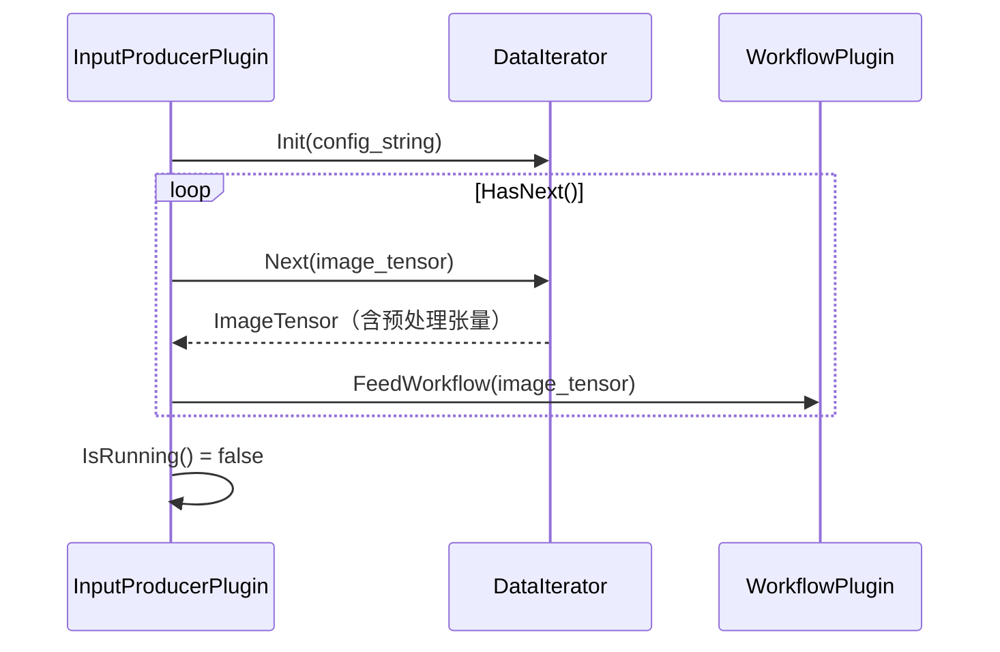

### 5.3 输入配置示例

```json
{
  "input_type": "bin_list",
  "input_files": [
    "nuscenes_bev_val/images_0.lst",
    "nuscenes_bev_val/images_1.lst"
  ],
  "need_pre_load": true,
  "limit": 12,
  "need_loop": false
}
```

---

## 6. 方法（Method）模块

### 6.1 类继承结构

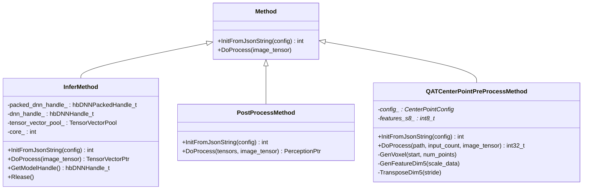

### 6.2 MethodFactory 工厂机制

所有 `PostProcessMethod` 子类通过宏 `DEFINE_AND_REGISTER_METHOD(ClassName)` 完成自动注册，`MethodFactory::GetImpl(method_type)` 按名称创建实例，无需修改工厂代码即可扩展新算法。

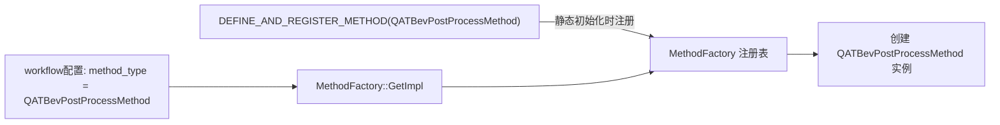

### 6.3 InferMethod 详解

`InferMethod` 封装了完整的 `hbDNN` 推理生命周期：

| 步骤 | 操作 |
|------|------|
| 初始化 | `hbDNNInitializeFromFiles` 加载 `.hbm` 模型文件 |
| 张量准备 | 从 `tensor_vector_pool_` 获取复用张量，避免重复申请内存 |
| 推理提交 | `hbDNNInfer` / `hbDNNInferV2` 提交任务到 BPU |
| 结果等待 | `hbDNNWaitTaskDone` 同步等待推理完成 |
| 资源释放 | `Release()` 归还张量到池，`hbDNNRelease` 卸载模型 |

**支持的推理配置：**

| 配置项 | 说明 |
|--------|------|
| `core` | BPU 核心选择（0=自动，1=core0，2=core1） |
| `model_file` | `.hbm` 模型文件路径 |
| `is_temporal_model` | 是否为时序模型 |
| `infer_fram_nums` | 单次推理帧数（多帧批量） |
| `temporal_input_tensors_idx` | 时序输入张量索引列表 |
| `temporal_output_tensors_idx` | 时序输出张量索引列表 |

### 6.4 后处理方法（PostProcessMethod）列表

后处理方法按算法任务类型注册，部分代表性实现如下：

| 注册名 | 对应任务 |
|--------|----------|
| `QATBevPostProcessMethod` | BEV 多任务（检测+分割） |
| `QATFlashoccPostProcessMethod` | FlashOcc 3D 占用网格 |
| `QATCenterPointPostProcessMethod` | CenterPoint 激光雷达3D检测 |
| `QATDet3DPostProcessMethod` | 相机3D目标检测 |
| `QATSegPostProcessMethod` | 语义分割 |
| `QATClsPostProcessMethod` | 图像分类 |
| `QATKeyPointPostProcessMethod` | 关键点检测 |
| `QATTrajPredPostProcessMethod` | 轨迹预测（DenseTNT） |
| `QATQCNetPostProcessMethod` | 轨迹预测（QCNet） |
| `QATMapPostProcessMethod` | 在线地图检测（MapTR） |

### 6.5 预处理方法（PreProcessMethod）

针对需要在 CPU 端完成特殊预处理的任务（主要是点云类），提供独立预处理方法：

**`QATCenterPointPreProcessMethod`** — 点云 Voxelization 预处理：
1. 读取原始点云 `.bin` 文件
2. `GenVoxel()` — 将点云离散化为体素坐标（`coors`）
3. `GenFeatureDim5()` — 提取每个体素的5维特征（x, y, z, intensity, 归一化距离）
4. `TransposeDim5()` — 按 BPU 推理所需步长进行转置
5. 量化为 `int8` 精度，写入 DNN 输入张量，调用 `hbUCPMemFlush` 刷新缓存

---

## 7. 输出（Output）模块

### 7.1 类继承与组合关系

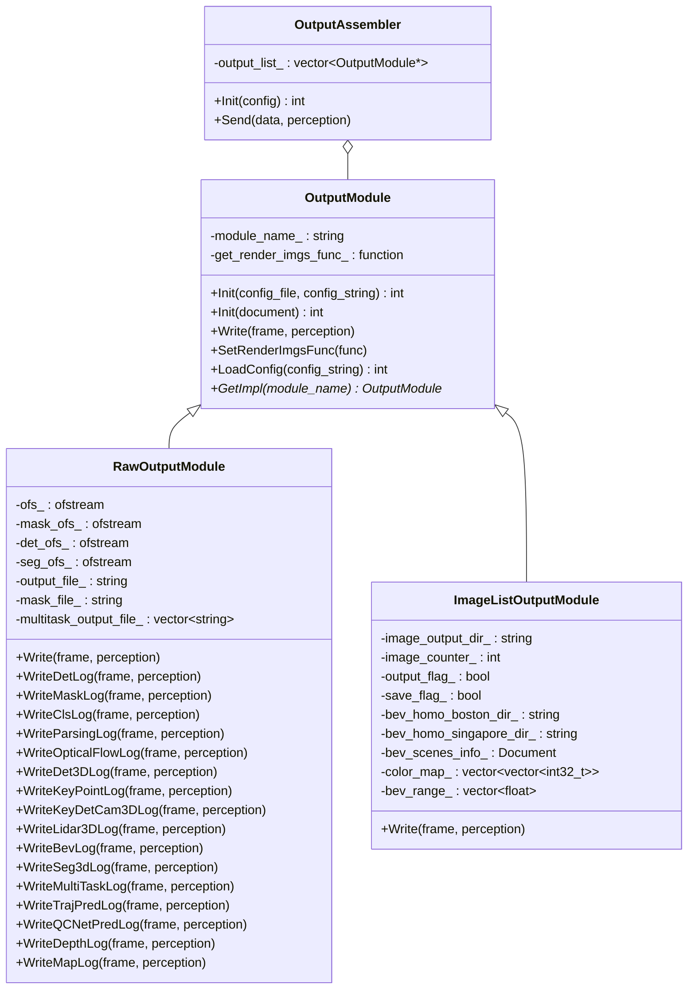

### 7.2 RawOutputModule（注册名：`eval`）

将感知结果以**结构化文本**格式写入文件，用于精度评测。`Write()` 内部按 `perception->type` 分发到对应的 `WriteXxxLog` 方法：

| 方法 | 对应感知类型 | 输出格式说明 |
|------|-------------|-------------|
| `WriteDetLog` | `DET` | `image_name: x1 y1 x2 y2 score label;...` |
| `WriteMaskLog` | `MASK` | 实例分割 mask 编码输出 |
| `WriteClsLog` | `CLS` | `image_name: label score;...` |
| `WriteParsingLog` | `SEG` | 逐像素语义标签 |
| `WriteOpticalFlowLog` | `POINT` | 光流向量序列 |
| `WriteDet3DLog` | `DET3D` | `image_name: x y z w l h r score label;...` |
| `WriteKeyPointLog` | `KEYPOINT` | 关键点坐标与置信度 |
| `WriteKeyDetCam3DLog` | `DETCAM3D` | 相机坐标系3D框参数 |
| `WriteLidar3DLog` | `LIDAR3D` | `image_name: label score xs ys h d0 d1 d2 rot vel0 vel1;...` |
| `WriteBevLog` | `BEV` | BEV检测框 + 分割结果 |
| `WriteSeg3dLog` | `SEG3D` | 3D语义分割标签 |
| `WriteMultiTaskLog` | `LIDARMULTITASK` | 激光雷达检测（det_ofs_）+ 分割（seg_ofs_）分别写出 |
| `WriteTrajPredLog` | `TRAJPRED` | 轨迹预测坐标序列 |
| `WriteQCNetPredLog` | `TRAJPRED_qcnet` | QCNet轨迹预测（含score和traj两个输出文件） |
| `WriteDepthLog` | `DEPTH` | 深度/光流点序列 |
| `WriteMapLog` | `MAP` | 在线地图向量化结果 |

> 多任务输出时，`RawOutputModule` 同时持有多个 `ofstream`（`ofs_`、`mask_ofs_`、`det_ofs_`、`seg_ofs_`），在 `Init` 阶段根据配置分别打开。

### 7.3 ImageListOutputModule（注册名：`image`）

将感知结果**可视化渲染**到图像并保存，核心逻辑：

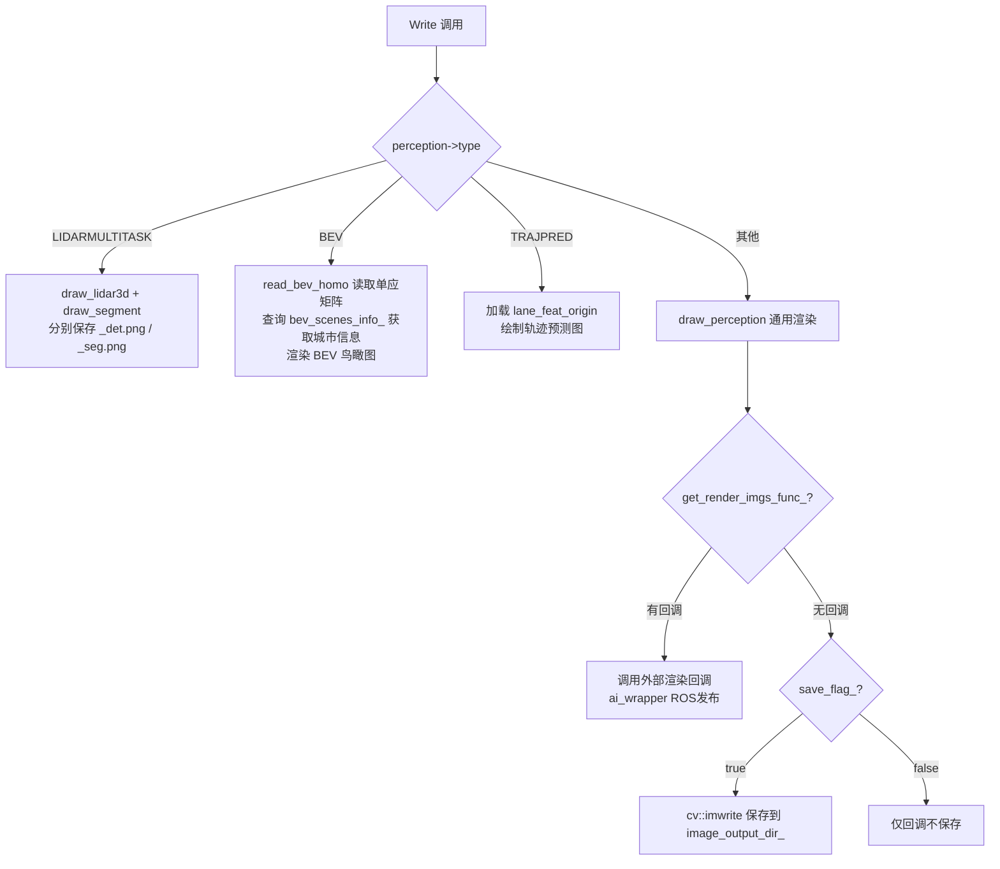

**BEV 可视化特殊处理：**
- 从 `bev_homo_boston_dir_` / `bev_homo_singapore_dir_` 加载透视变换矩阵
- 通过 `bev_scenes_info_`（`scenes.json`）根据 token 查询场景所在城市
- 按城市选择对应单应矩阵，将检测框和分割结果投影到 BEV 视角

### 7.4 OutputAssembler

`OutputAssembler` 实现**组合模式**，可同时挂载多个 `OutputModule`，一次 `Send` 调用触发所有子模块的 `Write`：

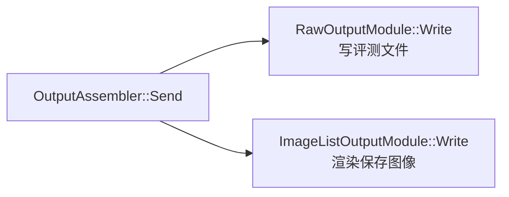

通过配置文件中的 `"raw_output_enable": true` 和 `"image_list_enable": true` 控制各子模块的激活。

### 7.5 注册机制

```cpp
// 宏展开后自动将类注册到全局工厂表
DEFINE_AND_REGISTER_OUTPUT(eval, RawOutputModule)
DEFINE_AND_REGISTER_OUTPUT(image, ImageListOutputModule)

// 按名称创建实例
OutputModule* mod = OutputModule::GetImpl("eval");
```

---

## 8. 工具（Utils）模块

| 文件 | 主要功能 |
|------|----------|
| `utils.cc` | 文件读写、JSON转字符串、矩阵求逆、坐标变换（`cam2img`、`points_cam2img`）、数据补零（`add_padding`）、BEV单应矩阵读取（`read_bev_homo`） |
| `image_utils.cc` | OpenCV渲染（`draw_perception`、`draw_rect`、`draw_bev_bbox`、`draw_lidar3d`、`draw_segment`）、图像格式转换（NHWC/NCHW）|
| `tensor_utils.cc` | 张量准备与量化处理（`prepare_batch_RelPos_and_quanti`）|
| `stop_watch.cc` | 高精度计时器（`Stopwatch`），统计 avg/max/min 耗时 |
| `nms.cc` | 非极大值抑制（`nms`、`yolo5_nms`，最大输入 400 个框） |
| `data_transformer.cc` | 数据格式转换 |

**性能统计宏（`common_def.h`）：**

`MODULE_PERF_START(name)` / `MODULE_PERF_END(name)` 是轻量级性能埋点宏，利用 `gettimeofday` 精确计时，每 10 次调用打印一次耗时，无需引入外部性能分析工具。

---

## 9. 配置系统

整个系统由一个顶层 JSON 配置文件驱动，结构如下：

```json
{
  "input_config": {
    "input_type": "image_list",
    "limit": 10
  },
  "workflow": [
    {
      "method_type": "InferMethod",
      "unique_name": "InferMethod",
      "method_config": {
        "model_file": "model.hbm",
        "core": 0,
        "is_temporal_model": false,
        "infer_fram_nums": 1,
        "temporal_input_tensors_idx": [],
        "temporal_output_tensors_idx": []
      }
    },
    {
      "thread_count": 2,
      "method_type": "QATBevPostProcessMethod",
      "unique_name": "QATBevPostProcessMethod",
      "method_config": { }
    }
  ],
  "output_config": {
    "output_type": "image",
    "in_order": true,
    "raw_output_enable": true,
    "image_list_enable": true,
    "image_output_dir": "output_images"
  }
}
```

---

## 10. 构建系统

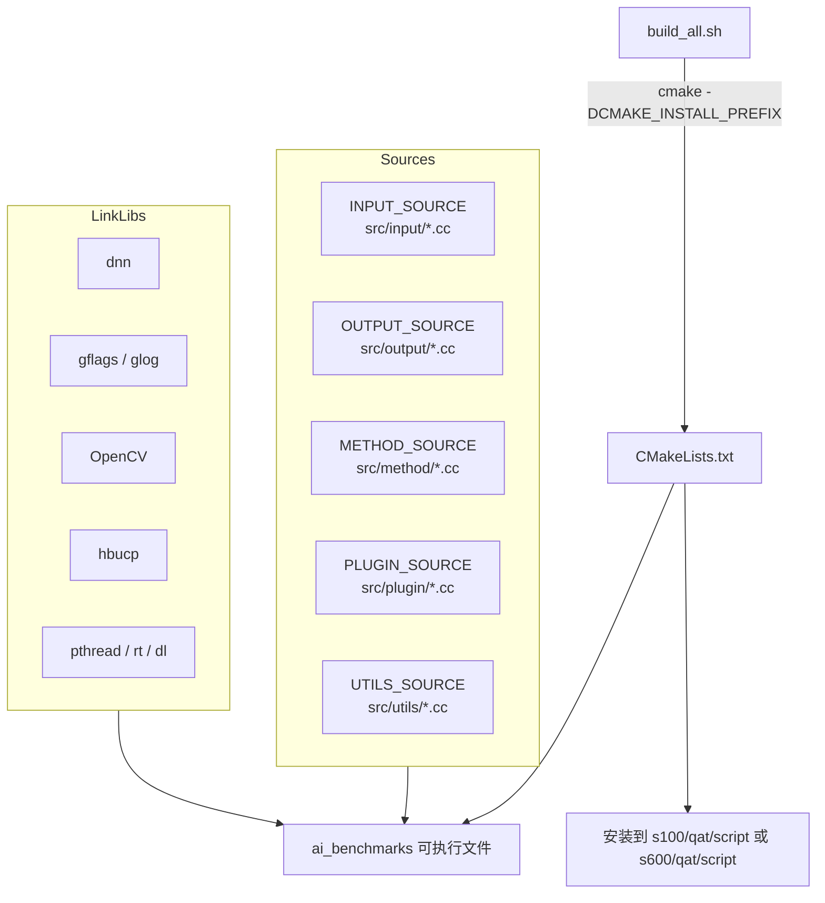

- **平台差异**：`build_all.sh -p s100` 或 `-p s600`，通过 `CMAKE_INSTALL_PREFIX` 控制安装路径
- **依赖库**：`libdnn.so`（DNN推理）、`hbucp`（内存管理）、`gflags/glog`（参数/日志）、`OpenCV`（图像处理）

---

## 11. ai_wrapper 封装层

[`ai_wrapper`](../../../ai_wrapper/src/ai_wrapper.cpp) 是对 `ai_core` 的 ROS2 封装，对外提供 `AIWrapper` 类：

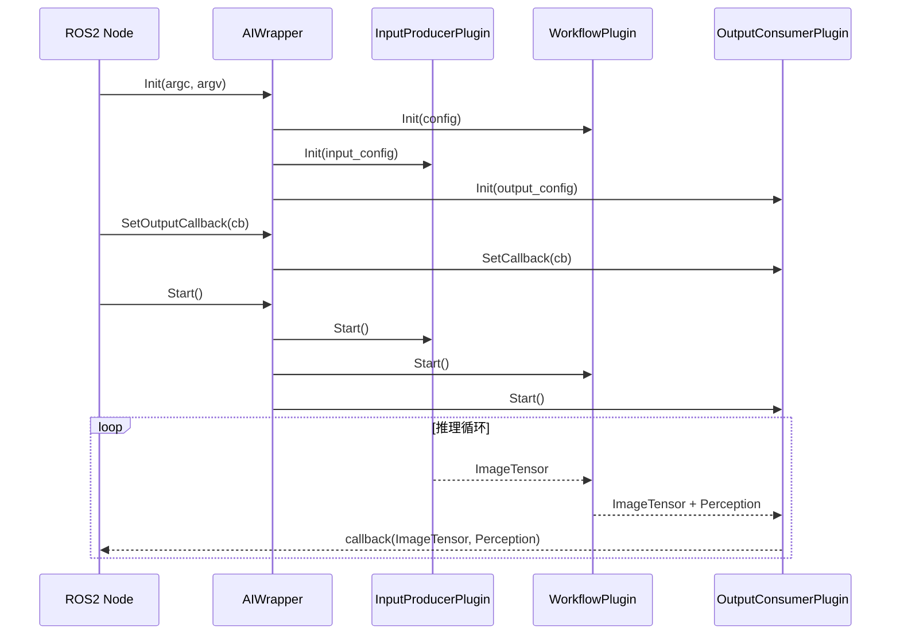